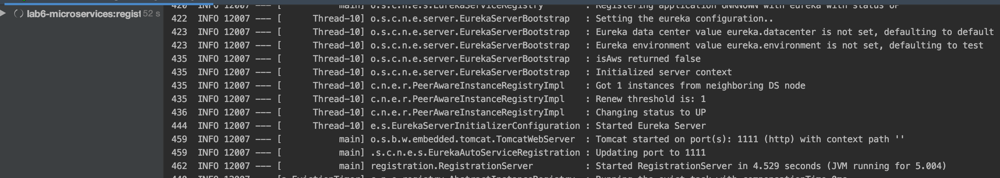
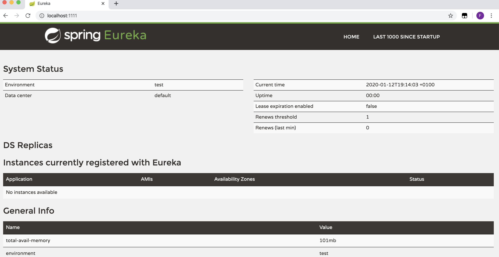
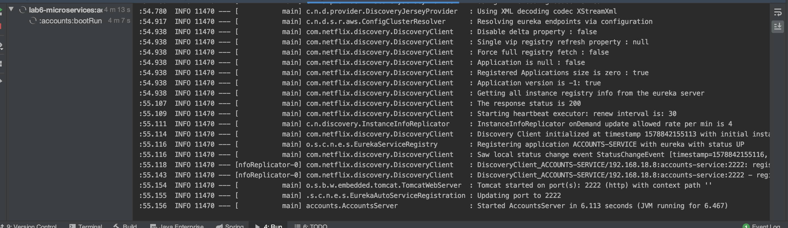
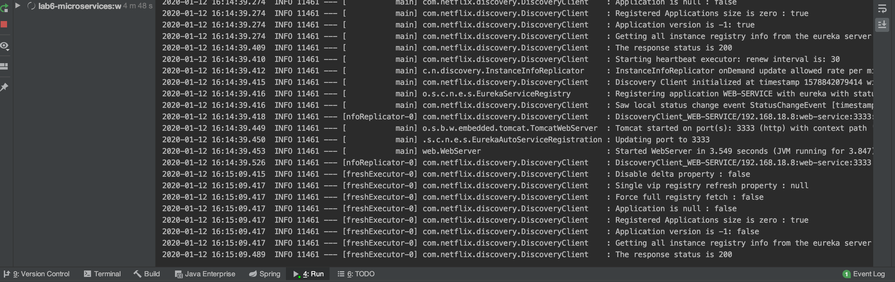
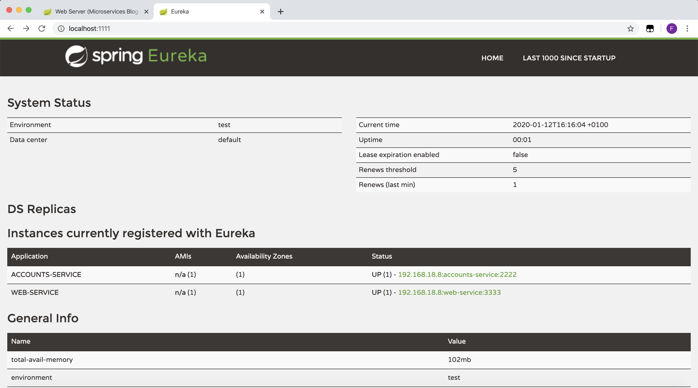
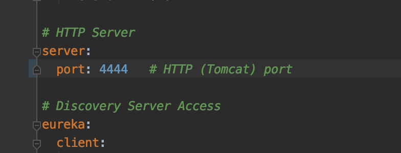
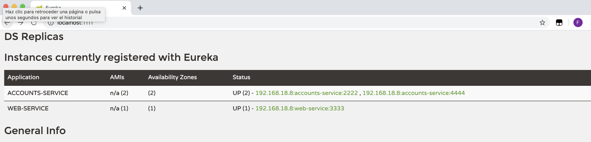
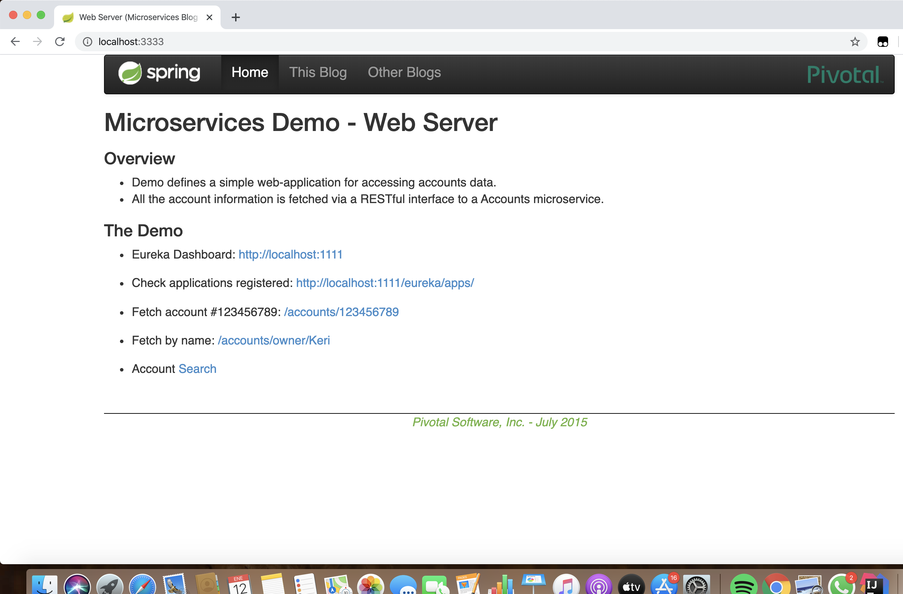
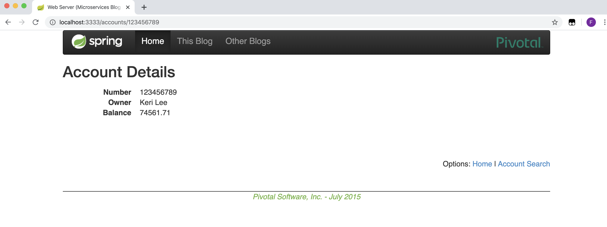

#LAB 6 - MICROSERVICES
#### 1.The two microservices are running and registered:
Launch service registration server called EUREKA in http://localhost:1111

Run Eureka without services in port 1111

And run all services

#### 2.The service registration service has the two microservices registered:
Dashboard Eureka

#### 3.A second account microservice is running in the port 4444 and it is registered:

Change in application.yml in accounts and run

Dashboard Eureka

#### 4.A brief report describing what happens when you kill the microservice with port 2222. Can the web service provide information about the accounts? Why?

Kill the account microservice on port 2222.
After deleting the account microservice, it does not appear in the Eureka panel but the accounts are accessible because it is a replica.

